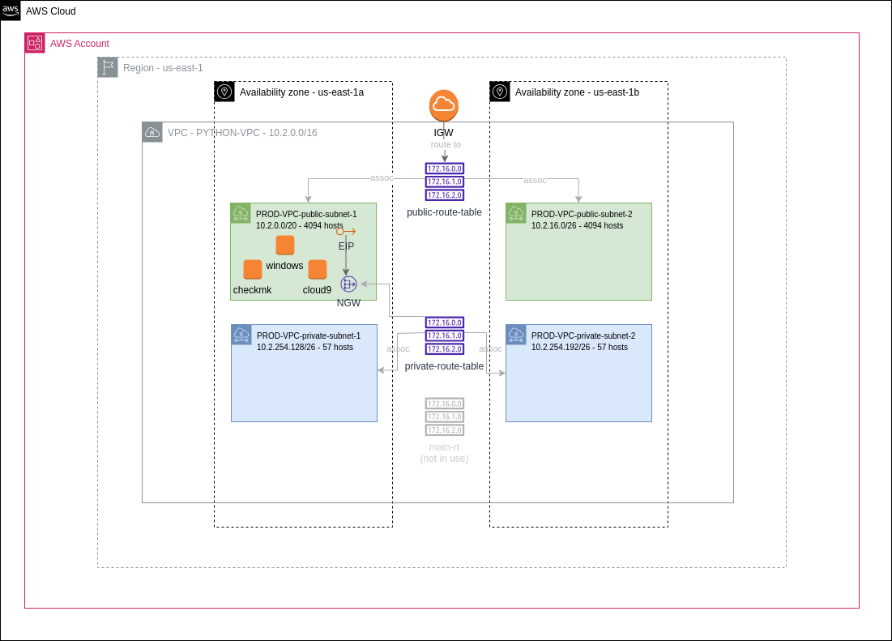

**********************
 aws-python-lab-setup
**********************

This repo sets up the prerequisite infrastructure for lab 5,
according to the instructions in the lab 1 slides.

It will create a VPC, a windows instance in public-subnet-1,
an ubuntu instance running checkmk in public-subnet-1, and
a cloud9 workspace named "python-automation". 

HTTP/S access to the checkmk instance is only available
from the windows instance. Both instances have an instance
profile that allows SSM actions.

**You will still need to manuall install requests and other dev
tools on the Cloud9 environment instance.**

How to run the code
-------------------
1. First, `install terraform <https://developer.hashicorp.com/terraform/install>`_, the `aws cli <https://docs.aws.amazon.com/cli/latest/userguide/getting-started-install.html>`_, and the `ssm aws-cli plugin <https://docs.aws.amazon.com/systems-manager/latest/userguide/session-manager-working-with-install-plugin.html>`_.
2. ``cd terraform/ && terraform apply``
3. After terraform has run, you'll have a ssh key in ``~/.ssh/aws-python-lab.pem``.
4. Get the cloud9 environment url with ``terraform output cloud9_url``.
5. Get the checkmk instances address with ``terraform output checkmk_ip``

How to connect to the instances
-------------------------------
To connect to the checkmk instance::

  $ eval "$(terraform output -raw checkmk_ssh_cmd)"

To connect to the windows instance, you'll need to do
some things through the web console. Follow `these steps
<https://docs.aws.amazon.com/AWSEC2/latest/WindowsGuide/connecting_to_windows_instance.html>`_. 
You can get the ip and port with::

  $ terraform output -raw windows_ip

To go to the Cloud9 environment, visit the url from the output::

  $ firefox "$(terraform output -raw cloud9_url)"

Connecting to the instances using Session Manager
-------------------------------------------------
If you prefer, you can use SSM to connect to the instances.
Example for the windows instance::

  ∿ windows_instance_id=$(aws ec2 describe-instances --query "Reservations[].Instances[?Tags[?Key=='Name' && Value=='windows']][].InstanceId" --output text)

  ∿ aws ssm start-session --target i-0051e243e659b7392
  Starting session with SessionId: chris-student-0e70e3dc015638ff4
  Windows PowerShell
  Copyright (C) Microsoft Corporation. All rights reserved.
  Install the latest PowerShell for new features and improvements! https://aka.ms/PSWindows
  PS C:\Windows\system32>

For the ubuntu instance, you can use this command to get the AMI.
(Or you can copy it from the web console).

::

  ∿ checkmk_instance_id=$(aws ec2 describe-instances --query "Reservations[].Instances[?Tags[?Key=='Name' && Value=='checkmk']][].InstanceId" --output text)

  ∿ aws ssm start-session --target $checkmk_instance_id 
  Starting session with SessionId: chris-student-0ef1aaacfe52c4a64
  $ cat /etc/os-release
  PRETTY_NAME="Ubuntu 22.04.3 LTS"
  NAME="Ubuntu"